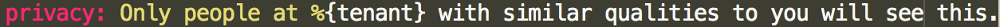

# Glassbreakers i18n Guide


* [File Hierarchy and Organization](#file-hierarchy-and-organization)
* [File Structure](#file-structure)
  * [Features](#features)
  * [Shared](#shared)
  * [Mailers](#mailers)
* [Style Guide](#style-guide)
  * [Standard Localization Formats](#standard-localization-formats)
  * [Naming conventions](#naming-conventions)
  * [Application Type](#application-type)
  * [Using Anchor labels](#using-anchor-labels)
  * [Quotes](#quotes)
  * [Links in Translations](#links-in-translations)

## File Hierarchy and Organization

All `i18n` files should live under

    `/config/locales/<locale>`

where each locale has its own subfolder.

Each locale should contain individual translation files for various functionality, organized in the following hierarchy

    config/
      locales/
        en/
          features/
            - dashboard.yml
            - blog.yml
            - messaging.yml
            - etc…
            - shared/
                - app.yml
                - user_card.yml
          mailers/
            - new_match_mailer.yml
            - inactive_message_mailer.yml
            - etc…


- **`features/`** - One file for each high-level feature of the application. These should contain translations that used only in these features. Translations used across multiple features should be in `shared/`
- **`features/shared/`** - Contains translations for modules or functionality common to multiple features. For example, the "Submit" or "Loading…" label on a button is not feature-specific and might be used in various places across the app.
- **`mailers/`** - One file for each mailer (which can contain multiple emails). Ideally, each file here should correspond to a file under `/app/mailers/*.rb`.


## File Structure

### Features

Use a descriptive grouping to organize each set of translations. A good rule of thumb is to use the page name to organize groups of translations

``` yml
en:
  profile:
    heading: "foo"
    subheading: "bar"
  edit_profile:
    heading: "FOO"
    subheading: "bar"
```

### Shared

Similar to the shared features, but using the name of the shared module instead

``` yml
en:
  button:
    submit: "Submit"
    loading: "Loading.."
```

### Mailers

Group each set of translations by email

``` yml
## config/locales/en/mailers/user_status_changed_mailer.rb

en:
  accepted:
    subject: "Accepted!"
    heading: "Some Heading"

  rejected:
    subject: "Rejected!"
    heading: "Some Heading"

  non_vertical:
    subject: "Non Vertical!"
    heading: "Some Heading"
```


## Style Guide

### Standard Localization Formats

The [rails i18n core](https://github.com/svenfuchs/rails-i18n/tree/master/rails/locale) already defines formats and measurements for multiple common locales. Use these when possible over re-defining common formats.

For dates and times in particular, use these time formats instead of `strftime()` in the views. For example, the following renders the time using the [standardized short format](https://github.com/svenfuchs/rails-i18n/blob/master/rails/locale/en-US.yml#L209)

``` ruby
<p><%= l(Time.now, format: :short) %></p>
```

### Naming conventions

Use the following standard name for keys

Key | Description
--- | ---
`heading` | Page or Section heading
`subheading` | Descriptive subtext
`label` | Any description for an HTML form element
`validation` | Client-side validation messages for forms
`flash` | Flash messages
`*_modal` | Indicates text for a modal (e.g. `paused_card_modal`)
`*_html` | Any translations that have inline HTML. Rails automatically interprets these as HTML safe


### Application Type

Use `enterprise` and `public` keys to specify the app type

``` yml
en:
  edit_profile:
    public:
      heading: "My Public Heading"
    enterprise:
      heading: "My Enterprise Heading"
```

These can be easily accessed in the view based on `app_type`:

``` ruby
t("edit_profile.#{app_type}.heading")
```

### Using Anchor labels

Use anchor labels (`&`) wherever possible to avoid duplicating common translations.

The key `common` should be used to define these. Anchor label names should be the translation path separated by `_`

``` yml
en:
  edit_profile:
    common:
      subheading: &edit_profile_common
      body: &edit_profile_common_body
        foo: "foo"
        bar: "bar"
    public:
      <<: *edit_profile_common
      heading: "My Public Heading"
    enterprise:
      <<: *edit_profile_common
      heading: "My Enterprise Heading"
      body:
        <<: *edit_profile_common_body
        foo: "foo 2.0"
```

In this example both the `public` and `enterprise` sections share a `common` set of translations that includes a `subheading` and some
Naming Guide. The `enterprise` key also overrides the `body:` subsection.

### Quotes

Wrap all translations in quotes to avoid the following formatting:



### Links in Translations

The default i18n gem functionality makes it hard to format links and HTML in the copy. The poorly-named but useful [it gem](https://github.com/iGEL/it) makes that easier.

``` yml
en:
  flash:
    success: "Success! %{link:Read more} about it here"
    fail: "Fail. Contact %{link:%{email}} to complain about it"
```

Call the above as follows:

``` ruby
csr_email = "foo@bar.com"

It.it("flash.success", link: It.link(faq_path))
It.it("flash.fail", link: It.link("mailto:#{csr_email}"), email: csr_email)
```

These bypass the usual `t(..)` translation call, so **use them only when you need a link**
